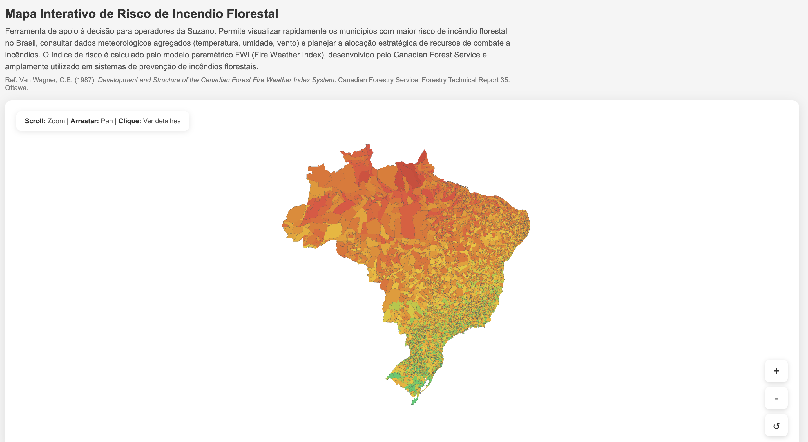
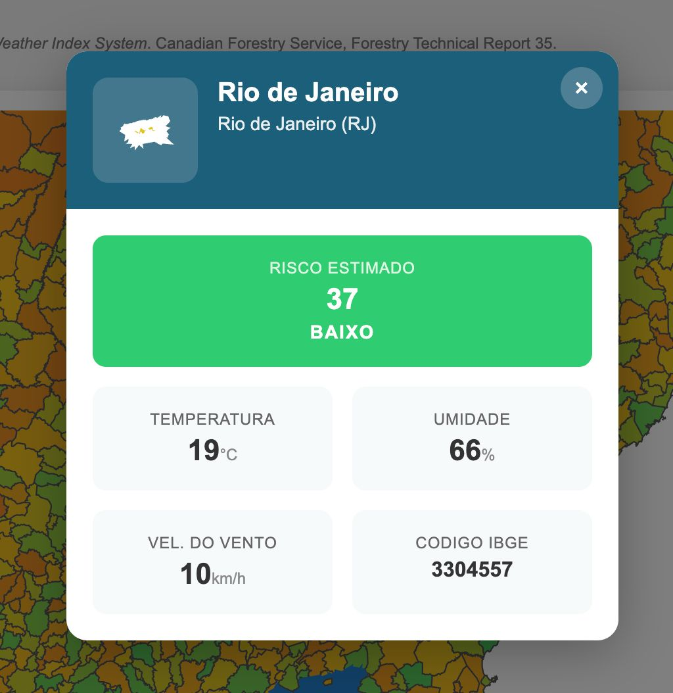

# Mapa Interativo de Risco de Incêndio Florestal - Brasil

Ferramenta de visualização interativa para análise de risco de incêndio florestal em municípios brasileiros, desenvolvida com D3.js v7.



## Descrição

Este projeto apresenta um mapa do Brasil em nível municipal, permitindo aos operadores visualizar rapidamente áreas com maior risco de incêndio florestal. O índice de risco é calculado pelo modelo paramétrico **FWI (Fire Weather Index)**, desenvolvido pelo Canadian Forest Service.

### Funcionalidades

- **Visualização por cores**: Municípios coloridos de acordo com o nível de risco (verde a vermelho escuro)
- **Zoom e pan**: Navegação interativa pelo mapa com scroll e arrastar
- **Detalhes ao clicar**: Modal com informações detalhadas do município selecionado
- **Dados meteorológicos**: Temperatura, umidade e velocidade do vento
- **Animações fluidas**: Transições suaves entre estados

### Detalhes do Município

Ao clicar em um município, um card é exibido com informações detalhadas:



### Níveis de Risco

| Cor | Nível | Índice FWI |
|-----|-------|------------|
| Verde | Baixo | 0-40 |
| Amarelo | Moderado | 40-80 |
| Laranja | Alto | 80-120 |
| Vermelho | Muito Alto | 120-160 |
| Vermelho Escuro | Crítico | 160-200 |

## Como Executar

1. Clone o repositório
2. Abra o arquivo `index.html` em um navegador moderno

Não é necessário servidor web - os dados geográficos estão embutidos no arquivo `geo.js`.

## Estrutura do Projeto

```
.
├── index.html          # Página principal com estilos CSS
├── mapa-interativo.js  # Lógica do mapa D3.js com animações
├── heatmap.js          # Versão simplificada do heatmap
├── geo.js              # Dados GeoJSON dos municípios brasileiros
└── geo.json            # Arquivo fonte dos dados geográficos
```

## Tecnologias

- **D3.js v7** - Biblioteca de visualização de dados
- **GeoJSON** - Formato de dados geográficos
- **HTML5/CSS3** - Interface responsiva

## Referência

Van Wagner, C.E. (1987). *Development and Structure of the Canadian Forest Fire Weather Index System*. Canadian Forestry Service, Forestry Technical Report 35. Ottawa.

## Autores

- **Davi Duarte**
- **Luiz Hinuy**

Desenvolvido para o Inteli - Módulo 5 (2026)
